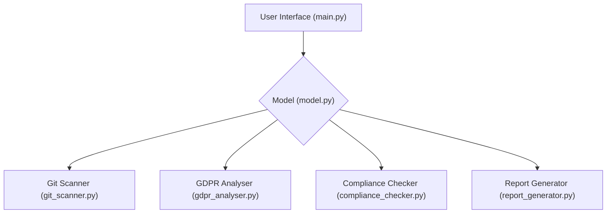

# EU GDPR Git Validator (TINS Edition)

## Description

This project is a GUI-based tool for analyzing Git repositories for compliance with the EU General Data Protection Regulation (GDPR). It is a refactoring of the original command-line tool, with a new user interface built using PySide6. The tool scans Git repositories for personal data, analyzes the data for compliance with GDPR articles, and generates detailed reports.

## Functionality

### Core Features

*   **Repository Scanning**: Scans Git repositories for personal data, including email addresses, author names, and other personally identifiable information (PII).
*   **GDPR Compliance Analysis**: Analyzes the scan results for compliance with key GDPR articles, such as the right to erasure and data portability.
*   **Fork Analysis**: Analyzes the propagation of personal data across repository forks.
*   **Report Generation**: Generates detailed compliance reports in various formats, including HTML, PDF, JSON, and Markdown.

### User Interface

The user interface is built with PySide6 and provides a user-friendly way to interact with the tool. It consists of the following components:

*   **Main Window**: A tabbed interface for accessing the different features of the tool.
*   **Scan View**: A view for configuring and running scans.
*   **Report View**: A view for displaying the compliance reports.
*   **Analysis View**: A view for displaying data analysis results.

### User Flows

1.  **Select Repository**: The user selects a Git repository to be analyzed.
2.  **Configure Scan**: The user configures the scan options, such as the GDPR articles to be checked.
3.  **Run Scan**: The user runs the scan.
4.  **View Report**: The user views the compliance report.
5.  **Save Report**: The user saves the report in the desired format.
6.  **Analyze Forks**: The user analyzes the forks of the repository.

### Edge Cases

*   **Invalid Repository**: If the user selects an invalid Git repository, the tool will display an error message.
*   **No Personal Data**: If no personal data is found in the repository, the tool will generate a report indicating that no violations were found.
*   **Scan Error**: If an error occurs during the scan, the tool will display an error message.

## Technical Implementation

### Architecture

The application follows the Model-View-Controller (MVC) pattern, with a clear separation between the business logic and the user interface.

### Data Model

The data model is encapsulated in the `Model` class in `model.py`. This class is responsible for all the backend operations, including scanning the repository, analyzing the data, and generating the report.

### Components

*   **`main.py`**: The main entry point of the application. It contains the view and controller logic for the PySide6-based GUI.
*   **`model.py`**: The business logic of the application. It encapsulates the functionality of the original `git_scanner.py`, `gdpr_analyser.py`, and `compliance_checker.py` modules.
*   **`src/gdpr_validator/`**: The original source code of the command-line tool.

### External Integrations

*   **PySide6**: The GUI is built using PySide6, the official Python bindings for the Qt framework.
*   **GitPython**: The tool uses the GitPython library to interact with Git repositories.
*   **Jinja2**: The HTML reports are generated using the Jinja2 template engine.
*   **WeasyPrint**: The PDF reports are generated using the WeasyPrint library.

## Style Guide

### Visual Design

The application uses a dark theme with the "Fusion" style, which provides a modern and professional look.

### Interactions

The application is event-driven, with the GUI communicating with the business logic using Qt's signals and slots mechanism.

### Responsive Behavior

The GUI is designed to be responsive and should work well on different screen sizes.

## Performance Requirements

The application should be able to scan large Git repositories without any performance issues. The scan is performed in a separate thread to prevent the GUI from freezing.

## Accessibility Requirements

The application should be accessible to all users, including those with disabilities. The GUI is designed to be keyboard-navigable and should work well with screen readers.

## Testing Scenarios

*   **Scan a repository with personal data**: The tool should correctly identify the personal data and generate a report with the violations.
*   **Scan a repository without personal data**: The tool should generate a report indicating that no violations were found.
*   **Save a report in different formats**: The tool should correctly save the report in the selected format.
*   **Analyze the forks of a repository**: The tool should correctly analyze the forks and display the results.

## Security Considerations

The tool does not store any personal data. It only scans the repository and generates a report. The report is stored locally on the user's machine and is not transmitted over the network.
